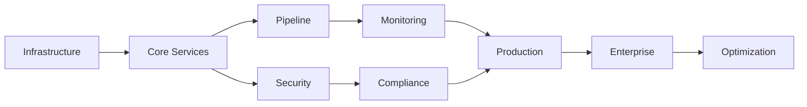

# MLOps Implementation Timeline & Milestones

## Overview
This document provides a detailed implementation timeline for the Cirruslabs MLOps platform, including key milestones, deliverables, dependencies, and critical paths.

## Master Timeline (9 Months)

### Visual Timeline Overview
```
Month 1  Month 2  Month 3  Month 4  Month 5  Month 6  Month 7  Month 8  Month 9
━━━━━━━━━━━━━━━━━━━━━━━━━━━━━━━━━━━━━━━━━━━━━━━━━━━━━━━━━━━━━━━━━━━━━━━━━━━━
[====Foundation====][=====Core Platform=====][===Advanced===][==Enterprise==]
        ↓                    ↓                      ↓               ↓
      Pilot              Limited Prod          Full Prod      Optimization
```

## Detailed Implementation Schedule

### Month 1: Project Initiation & Infrastructure

#### Week 1-2: Project Setup
| Task | Duration | Owner | Deliverable |
|------|----------|-------|-------------|
| Project kickoff | 1 day | PM | Kickoff deck, charter |
| Team onboarding | 3 days | PM | Team roster, RACI |
| Environment access | 2 days | DevOps | Access credentials |
| Tool provisioning | 3 days | DevOps | Development tools |
| Architecture review | 2 days | Architect | Final architecture |

#### Week 3-4: Infrastructure Foundation
| Task | Duration | Owner | Deliverable |
|------|----------|-------|-------------|
| K8s cluster setup | 5 days | DevOps | Dev/staging clusters |
| Database deployment | 3 days | DevOps | PostgreSQL, Redis |
| Storage configuration | 2 days | DevOps | S3/blob storage |
| Networking setup | 3 days | DevOps | VPC, security groups |
| CI/CD pipeline | 3 days | DevOps | Jenkins/GitLab CI |

**Milestone 1**: Infrastructure Ready ✓
- Success Criteria: All environments accessible, CI/CD operational

### Month 2: Core Services & Pilot

#### Week 5-6: Core Services Deployment
| Task | Duration | Owner | Deliverable |
|------|----------|-------|-------------|
| Model registry deploy | 5 days | ML Eng | Basic registry API |
| Auth service setup | 3 days | DevOps | OAuth2/SAML |
| Basic monitoring | 3 days | DevOps | Prometheus/Grafana |
| API gateway | 2 days | DevOps | Kong/Istio setup |
| Initial testing | 2 days | QA | Test results |

#### Week 7-8: Pilot Launch
| Task | Duration | Owner | Deliverable |
|------|----------|-------|-------------|
| Pilot team selection | 1 day | PM | Team list |
| User training | 2 days | Training | Training materials |
| First model deployment | 3 days | Pilot team | Deployed model |
| Feedback collection | 5 days | PM | Feedback report |
| Issue resolution | 3 days | Dev team | Bug fixes |

**Milestone 2**: Successful Pilot ✓
- Success Criteria: 2+ models deployed, >80% user satisfaction

### Month 3: Pipeline Orchestration & Scaling

#### Week 9-10: Pipeline Implementation
| Task | Duration | Owner | Deliverable |
|------|----------|-------|-------------|
| Airflow deployment | 3 days | ML Eng | Orchestrator ready |
| Pipeline templates | 5 days | ML Eng | Reusable DAGs |
| Data connectors | 5 days | Data Eng | 5+ connectors |
| Feature store setup | 3 days | Data Eng | Basic feature store |
| Integration testing | 2 days | QA | Test report |

#### Week 11-12: Monitoring & Analytics
| Task | Duration | Owner | Deliverable |
|------|----------|-------|-------------|
| Drift detection | 5 days | ML Eng | Drift algorithms |
| Performance monitoring | 3 days | ML Eng | Model metrics |
| Alerting system | 2 days | DevOps | Alert rules |
| Dashboard creation | 3 days | ML Eng | Grafana dashboards |
| Load testing | 2 days | QA | Performance report |

**Milestone 3**: Advanced Features Ready ✓
- Success Criteria: Automated pipelines, drift detection operational

### Month 4: Security & Compliance

#### Week 13-14: Security Implementation
| Task | Duration | Owner | Deliverable |
|------|----------|-------|-------------|
| RBAC implementation | 5 days | Security | Role definitions |
| Encryption setup | 3 days | Security | TLS, encryption |
| Vulnerability scanning | 2 days | Security | Security report |
| Penetration testing | 3 days | Security | Pentest results |
| Security training | 1 day | Training | Security guide |

#### Week 15-16: Compliance Framework
| Task | Duration | Owner | Deliverable |
|------|----------|-------|-------------|
| Audit logging | 3 days | Compliance | Audit system |
| Compliance reporting | 3 days | Compliance | Report templates |
| Policy engine | 3 days | Compliance | Policy rules |
| Documentation | 2 days | Tech Writer | Compliance docs |
| Audit simulation | 1 day | Compliance | Audit readiness |

**Milestone 4**: Security & Compliance Complete ✓
- Success Criteria: Pass security audit, compliance framework operational

### Month 5: Limited Production Rollout

#### Week 17-18: Production Preparation
| Task | Duration | Owner | Deliverable |
|------|----------|-------|-------------|
| Prod cluster setup | 5 days | DevOps | HA K8s cluster |
| Data migration | 3 days | Data Eng | Migrated data |
| User migration | 2 days | IT | User accounts |
| Training sessions | 3 days | Training | Trained teams |
| Runbook creation | 2 days | DevOps | Ops runbooks |

#### Week 19-20: Limited Production Launch
| Task | Duration | Owner | Deliverable |
|------|----------|-------|-------------|
| Team onboarding | 5 days | PM | 5-10 teams active |
| Production models | 5 days | ML Teams | 10+ models |
| Performance tuning | 3 days | DevOps | Optimized config |
| Issue tracking | Ongoing | Support | Issue log |
| Success metrics | 2 days | PM | Metrics report |

**Milestone 5**: Limited Production Success ✓
- Success Criteria: 10+ production models, <2% error rate

### Month 6: Enterprise Integration

#### Week 21-22: Legacy Integration
| Task | Duration | Owner | Deliverable |
|------|----------|-------|-------------|
| Legacy connectors | 5 days | Integration | 3+ connectors |
| API development | 5 days | Backend | REST/gRPC APIs |
| Webhook setup | 2 days | Backend | Event system |
| Integration testing | 3 days | QA | Test results |
| Documentation | 2 days | Tech Writer | Integration guide |

#### Week 23-24: Advanced Features
| Task | Duration | Owner | Deliverable |
|------|----------|-------|-------------|
| AutoML integration | 5 days | ML Eng | AutoML capability |
| A/B testing | 3 days | ML Eng | Experimentation |
| Edge deployment | 3 days | ML Eng | Edge support |
| Custom workflows | 3 days | Backend | Workflow engine |
| Feature validation | 2 days | QA | Feature tests |

**Milestone 6**: Full Feature Set ✓
- Success Criteria: All planned features operational

### Month 7: Full Production Rollout

#### Week 25-26: Enterprise Deployment
| Task | Duration | Owner | Deliverable |
|------|----------|-------|-------------|
| All teams migration | 5 days | PM | 100% adoption |
| Performance optimization | 3 days | DevOps | Optimized platform |
| Capacity planning | 2 days | DevOps | Scaling plan |
| Support escalation | 2 days | Support | Support process |
| Executive review | 1 day | PM | Status report |

#### Week 27-28: Stabilization
| Task | Duration | Owner | Deliverable |
|------|----------|-------|-------------|
| Bug fixes | 5 days | Dev Team | Stable platform |
| Performance tuning | 3 days | DevOps | <100ms latency |
| Documentation update | 3 days | Tech Writer | Complete docs |
| Training completion | 2 days | Training | All users trained |
| Metrics review | 1 day | PM | KPI dashboard |

**Milestone 7**: Enterprise Adoption ✓
- Success Criteria: >95% user adoption, all KPIs met

### Month 8-9: Optimization & Excellence

#### Week 29-32: Platform Optimization
| Task | Duration | Owner | Deliverable |
|------|----------|-------|-------------|
| Cost optimization | 5 days | FinOps | 30% cost reduction |
| Performance enhancement | 5 days | DevOps | 25% faster |
| Advanced monitoring | 5 days | ML Eng | Predictive alerts |
| Automation improvement | 5 days | DevOps | 90% automated |

#### Week 33-36: Center of Excellence
| Task | Duration | Owner | Deliverable |
|------|----------|-------|-------------|
| Best practices | 5 days | ML Eng | Practice guide |
| Community building | 3 days | PM | User community |
| Innovation lab | 5 days | R&D | New capabilities |
| Knowledge base | 3 days | Tech Writer | KB system |
| Future roadmap | 2 days | Product | 2024 roadmap |

**Milestone 8**: Optimization Complete ✓
- Success Criteria: All optimization targets achieved

## Critical Path Analysis

### Critical Path Items
1. **Infrastructure Setup** → Core Services → Pipeline → Production
2. **Security Implementation** → Compliance → Audit Readiness
3. **Pilot Success** → Limited Production → Full Rollout

### Dependencies


## Risk Timeline

### High-Risk Periods
| Period | Risk | Mitigation |
|--------|------|------------|
| Week 3-4 | Infrastructure delays | Pre-order hardware, parallel tasks |
| Week 7-8 | Pilot failure | Careful selection, strong support |
| Week 19-20 | Production issues | Gradual rollout, rollback plan |
| Week 25-26 | Scale problems | Load testing, auto-scaling |

## Resource Loading

### Team Allocation Timeline
```
        M1   M2   M3   M4   M5   M6   M7   M8   M9
DevOps   ████ ███  ██   █    ███  ██   ███  ██   █
ML Eng   ██   ███  ████ ███  ███  ████ ███  ███  ████
Data Eng █    ██   ████ ██   ███  ██   ██   █    █
Security      █    ██   ████ ██   █    █    █    
QA       █    ██   ███  ███  ███  ██   ██   █    
Support       █    ██   ███  ████ ████ ████ ███  ██
Training      ██   █    ██   ███  ██   ███  █    █
```

## Success Metrics Timeline

### Monthly KPI Targets
| Month | Adoption | Models | Accuracy | Cost Savings | Uptime |
|-------|----------|--------|----------|--------------|--------|
| M1 | - | - | - | - | - |
| M2 | 10 users | 2 | Baseline | - | 95% |
| M3 | 50 users | 5 | +10% | 10% | 97% |
| M4 | 100 users | 10 | +15% | 15% | 98% |
| M5 | 200 users | 20 | +20% | 20% | 99% |
| M6 | 300 users | 35 | +22% | 25% | 99.5% |
| M7 | 400+ users | 50+ | +25% | 30% | 99.9% |
| M8 | Stable | 60+ | +25% | 35% | 99.9% |
| M9 | Stable | 75+ | +27% | 40% | 99.95% |

## Communication Calendar

### Regular Checkpoints
| Frequency | Meeting | Stakeholders | Purpose |
|-----------|---------|--------------|---------|
| Daily | Standup | Dev team | Progress sync |
| Weekly | Status | PM, Tech leads | Issue resolution |
| Bi-weekly | Steering | Executives | Strategic alignment |
| Monthly | Review | All stakeholders | Milestone review |
| Quarterly | QBR | C-suite | Business review |

## Budget Release Schedule

### Phased Budget Release
| Milestone | Budget Release | Amount | Contingency |
|-----------|----------------|--------|-------------|
| M1: Infrastructure | 100% | $425K | 10% |
| M2: Pilot Success | 75% | $600K | 15% |
| M3: Advanced Features | 50% | $600K | 15% |
| M4: Security/Compliance | 100% | $400K | 10% |
| M5: Limited Production | 75% | $600K | 20% |
| M6: Full Features | 50% | $500K | 15% |
| M7: Enterprise | 50% | $450K | 20% |
| M8: Optimization | 100% | $400K | 10% |

## Post-Implementation Roadmap

### Months 10-12: Continuous Improvement
- Quarterly feature releases
- Advanced AI/ML capabilities
- Multi-cloud support
- Global expansion planning
- ROI optimization

### Year 2 Vision
- Self-service ML platform
- Automated governance
- Real-time ML capabilities
- Edge AI expansion
- ML marketplace

This implementation timeline provides a clear path from project initiation to full enterprise deployment, with defined milestones, success criteria, and risk mitigation strategies throughout the journey.