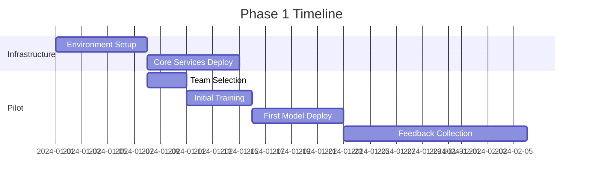

# MLOps Platform Phased Rollout Plan

## Executive Summary
This document outlines a risk-managed, phased approach to rolling out the Cirruslabs MLOps platform across the enterprise. The plan emphasizes gradual adoption, continuous feedback, and measurable success criteria at each phase.

## Rollout Strategy Overview

### Guiding Principles
1. **Risk Mitigation**: Start small, learn fast, scale gradually
2. **User-Centric**: Continuous feedback and adaptation
3. **Value-Driven**: Demonstrate ROI at each phase
4. **Change Management**: Strong focus on training and adoption
5. **Technical Excellence**: Maintain quality and performance standards

## Phase 1: Foundation & Pilot (Months 1-2)

### Objectives
- Establish core infrastructure
- Validate architecture with pilot team
- Demonstrate basic MLOps capabilities
- Gather initial feedback

### Target Users
- **Teams**: 1-2 pilot teams
- **Users**: 5-10 power users
- **Use Cases**: 2-3 low-risk ML projects

### Deployment Scope
```yaml
components:
  infrastructure:
    - kubernetes_cluster: dev/staging
    - databases: single instance
    - storage: basic configuration
  
  modules:
    - model_registry: basic features
    - pipeline_orchestrator: manual triggers
    - monitoring: basic metrics
    - security: authentication only
```

### Success Criteria
| Metric | Target | Measurement |
|--------|--------|-------------|
| System Uptime | >95% | Monitoring dashboard |
| Model Deployment Success | >90% | Deployment logs |
| User Satisfaction | >7/10 | Survey feedback |
| Time to Deploy Model | <2 hours | Process metrics |

### Activities & Timeline


### Risk Mitigation
- **Risk**: Infrastructure instability
  - **Mitigation**: Daily health checks, automated recovery
- **Risk**: User resistance
  - **Mitigation**: Dedicated support, daily standups
- **Risk**: Integration failures
  - **Mitigation**: Fallback procedures, manual workarounds

## Phase 2: Limited Production (Months 3-4)

### Objectives
- Scale to multiple teams
- Implement advanced features
- Establish operational procedures
- Measure productivity gains

### Target Users
- **Teams**: 5-10 teams
- **Users**: 50-100 users
- **Use Cases**: 10-15 production ML models

### Deployment Scope
```yaml
components:
  infrastructure:
    - kubernetes_cluster: production grade
    - databases: high availability
    - storage: distributed configuration
  
  modules:
    - model_registry: versioning, lineage
    - pipeline_orchestrator: scheduled runs
    - monitoring: drift detection
    - security: RBAC implementation
    - compliance: audit logging
```

### Enhanced Features
1. **Automated Pipelines**
   - CI/CD integration
   - Automated testing
   - Scheduled retraining

2. **Advanced Monitoring**
   - Real-time dashboards
   - Drift detection alerts
   - Performance analytics

3. **Security Enhancements**
   - Role-based access control
   - Encryption at rest/transit
   - Security scanning

### Success Criteria
| Metric | Target | Measurement |
|--------|--------|-------------|
| System Uptime | >99% | Monitoring dashboard |
| Model Accuracy Improvement | >15% | Model metrics |
| Deployment Frequency | >5x increase | Pipeline metrics |
| Cost Reduction | >20% | Financial analysis |
| User Adoption | >80% | Usage statistics |

### Change Management Plan
```yaml
training_program:
  week_1:
    - platform_overview: 2h
    - hands_on_workshop: 4h
    - use_case_planning: 2h
  
  week_2:
    - advanced_features: 3h
    - best_practices: 2h
    - troubleshooting: 3h
  
  ongoing:
    - office_hours: 2h/week
    - documentation: continuous
    - community_forum: 24/7
```

### Feedback Mechanisms
- Weekly user surveys
- Bi-weekly stakeholder reviews
- Monthly metrics reviews
- Continuous improvement board

## Phase 3: Enterprise Rollout (Months 5-6)

### Objectives
- Full enterprise deployment
- Complete feature enablement
- Establish center of excellence
- Achieve target ROI

### Target Users
- **Teams**: All ML/AI teams
- **Users**: 300+ users
- **Use Cases**: 50+ production models

### Full Feature Deployment
```yaml
advanced_capabilities:
  ml_operations:
    - automated_retraining
    - a_b_testing
    - multi_model_serving
    - edge_deployment
  
  enterprise_features:
    - sso_integration
    - legacy_system_connectors
    - custom_workflows
    - api_marketplace
  
  compliance_security:
    - full_audit_trail
    - compliance_reporting
    - disaster_recovery
    - geo_redundancy
```

### Organizational Structure
```
MLOps Center of Excellence
├── Platform Team (10-15 people)
│   ├── Infrastructure Engineers
│   ├── ML Engineers
│   └── DevOps Engineers
├── Support Team (5-8 people)
│   ├── User Support
│   ├── Documentation
│   └── Training
└── Governance Board
    ├── Technical Leaders
    ├── Business Stakeholders
    └── Compliance Officers
```

### Success Criteria
| Metric | Target | Measurement |
|--------|--------|-------------|
| Platform Adoption | >95% | Active users/total |
| Time-to-Market | 40% reduction | Project timelines |
| Model Performance | 25% improvement | Average accuracy |
| Operational Cost | 30% reduction | Cost analysis |
| Compliance Score | 100% | Audit results |

### Scaling Strategy
1. **Geographic Expansion**
   - Multi-region deployment
   - Local data residency
   - Global load balancing

2. **Capacity Planning**
   - Auto-scaling policies
   - Resource optimization
   - Cost management

3. **Performance Optimization**
   - Caching strategies
   - Model optimization
   - Infrastructure tuning

## Phase 4: Optimization & Innovation (Months 7-9)

### Objectives
- Optimize platform performance
- Implement advanced AI/ML capabilities
- Establish thought leadership
- Drive innovation culture

### Advanced Capabilities
```yaml
innovation_features:
  automl:
    - automated_feature_engineering
    - neural_architecture_search
    - hyperparameter_optimization
  
  advanced_serving:
    - multi_armed_bandits
    - contextual_bandits
    - online_learning
  
  explainability:
    - model_interpretability
    - feature_importance
    - decision_trees
```

### Continuous Improvement
- Quarterly platform reviews
- User feedback integration
- Technology radar updates
- Best practices evolution

## Rollout Communication Plan

### Stakeholder Communication
```yaml
communication_matrix:
  executives:
    frequency: monthly
    format: dashboard + presentation
    focus: roi, strategic_alignment
  
  team_leads:
    frequency: bi-weekly
    format: progress_reports
    focus: adoption, blockers
  
  end_users:
    frequency: weekly
    format: newsletter, forums
    focus: tips, updates, success_stories
```

### Success Stories & Case Studies
1. **Pilot Success**: Document 2-3 pilot successes
2. **Quick Wins**: Highlight 5-10 quick wins
3. **ROI Stories**: Quantify 3-5 major impacts
4. **User Testimonials**: Collect 10+ testimonials

## Risk Management

### Risk Matrix
| Risk | Probability | Impact | Mitigation |
|------|------------|--------|------------|
| Technical Debt | Medium | High | Regular refactoring sprints |
| User Adoption | Low | High | Strong change management |
| Performance Issues | Medium | Medium | Proactive monitoring |
| Security Breach | Low | Critical | Security-first design |
| Compliance Violation | Low | High | Automated compliance checks |

### Contingency Plans
1. **Rollback Procedures**
   - Version control for all components
   - Database backup strategies
   - Configuration management

2. **Incident Response**
   - 24/7 on-call rotation
   - Escalation procedures
   - War room protocols

3. **Business Continuity**
   - Disaster recovery plan
   - Backup data centers
   - Failover procedures

## Budget & Resource Planning

### Phase-wise Budget Allocation
| Phase | Infrastructure | Personnel | Training | Tools | Total |
|-------|---------------|-----------|----------|-------|-------|
| Phase 1 | $150K | $200K | $25K | $50K | $425K |
| Phase 2 | $250K | $400K | $50K | $100K | $800K |
| Phase 3 | $400K | $600K | $75K | $150K | $1.225M |
| Phase 4 | $200K | $800K | $50K | $100K | $1.15M |

### Resource Requirements
```yaml
human_resources:
  phase_1:
    - ml_engineers: 3
    - devops: 2
    - support: 1
  
  phase_2:
    - ml_engineers: 6
    - devops: 4
    - support: 3
    - trainers: 2
  
  phase_3:
    - ml_engineers: 10
    - devops: 6
    - support: 5
    - trainers: 3
    - governance: 2
```

## Success Metrics Dashboard

### Key Performance Indicators
```yaml
technical_kpis:
  - model_deployment_time
  - system_availability
  - api_response_time
  - resource_utilization

business_kpis:
  - time_to_market
  - model_accuracy
  - cost_savings
  - revenue_impact

adoption_kpis:
  - active_users
  - models_deployed
  - pipeline_executions
  - feature_usage
```

### Reporting Cadence
- Daily: Operational metrics
- Weekly: Adoption trends
- Monthly: Business impact
- Quarterly: Strategic review

## Post-Rollout Activities

### Continuous Evolution
1. **Platform Enhancements**
   - Quarterly feature releases
   - Performance optimizations
   - Security updates

2. **Community Building**
   - User groups
   - Hackathons
   - Knowledge sharing

3. **Strategic Partnerships**
   - Cloud providers
   - Tool vendors
   - Academic institutions

This phased rollout plan ensures a systematic, risk-managed approach to deploying the MLOps platform while maximizing value delivery and user adoption.