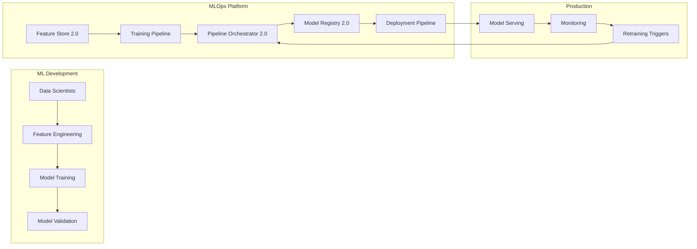
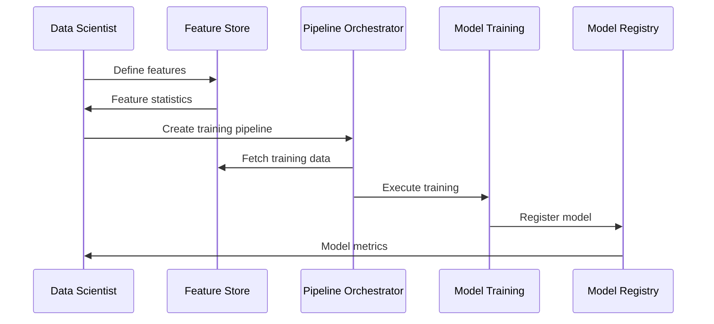
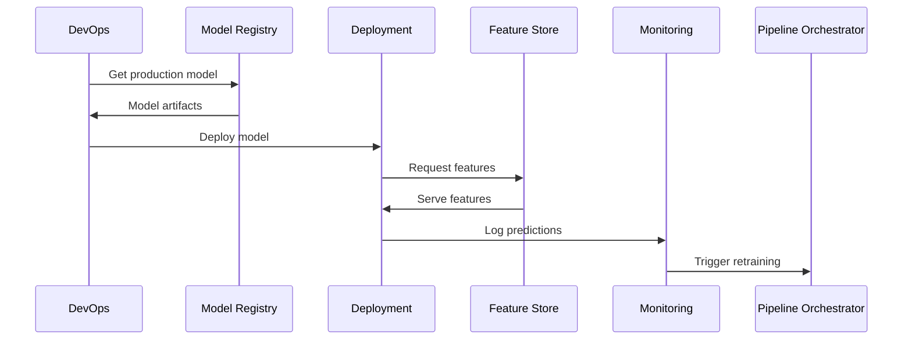

# MLOps Platform Overview

## 🎯 Introduction

The Healthcare AI MLOps Platform demonstrates enterprise-grade machine learning operations with three core services that work together to provide a complete ML lifecycle management solution.

## 🏗️ Platform Architecture



## 🚀 Core Services

### 1. Model Registry 2.0
**Universal Model Management Platform**

The Model Registry serves as the central hub for all machine learning models, providing:

- **Framework Agnostic**: Support for sklearn, TensorFlow, PyTorch, XGBoost, and more
- **Lifecycle Management**: Track models from development through production
- **Rich Metadata**: Store hyperparameters, metrics, lineage, and artifacts
- **Version Control**: Complete history of model iterations
- **Integration Ready**: APIs for CI/CD pipeline integration

**Key Features:**
```python
# Register a model
model = registry.register_model(
    name="healthcare-classifier",
    framework="sklearn",
    metrics={"accuracy": 0.95, "f1": 0.93},
    artifacts=["model.pkl", "preprocessor.pkl"]
)

# Promote to production
registry.promote_model(model.id, stage="production")
```

### 2. Pipeline Orchestrator 2.0
**Intelligent Workflow Automation Engine**

The Pipeline Orchestrator manages complex ML workflows with:

- **DAG-based Workflows**: Define dependencies and parallel execution
- **Resource Management**: Intelligent CPU/GPU allocation
- **ML-Specific Operators**: Pre-built tasks for common ML operations
- **Fault Tolerance**: Retry policies and failure recovery
- **Monitoring**: Real-time pipeline execution tracking

**Key Features:**
```python
# Define ML pipeline
pipeline = {
    "name": "healthcare-ml-pipeline",
    "tasks": [
        {"name": "fetch-data", "operator": "data_ingestion"},
        {"name": "validate", "operator": "data_validation"},
        {"name": "train", "operator": "model_training"},
        {"name": "register", "operator": "model_registration"}
    ]
}

# Execute pipeline
orchestrator.run_pipeline(pipeline)
```

### 3. Feature Store 2.0
**Real-time Feature Management Platform**

The Feature Store provides centralized feature management with:

- **Dual Storage**: Offline store for training, online store for serving
- **Point-in-Time Correctness**: Prevent data leakage
- **Low Latency Serving**: <10ms feature retrieval
- **Feature Versioning**: Track feature evolution
- **Monitoring**: Feature quality and usage metrics

**Key Features:**
```python
# Define features
feature_store.create_feature_set(
    name="patient_features",
    features=["age", "visit_count", "risk_score"]
)

# Serve features online
features = feature_store.get_online_features(
    entities={"patient_id": "12345"},
    features=["age", "risk_score"]
)
```

## 🔄 ML Lifecycle Integration

### 1. Development Phase


### 2. Deployment Phase


## 🎯 Use Cases

### 1. Automated Model Training
```python
# Weekly retraining pipeline
@orchestrator.schedule("0 0 * * 0")  # Every Sunday
def weekly_retraining():
    # Get latest features
    features = feature_store.get_training_data(
        feature_set="patient_features",
        start_date=last_week()
    )
    
    # Train model
    model = train_model(features)
    
    # Register if improved
    if model.metrics["accuracy"] > current_model.metrics["accuracy"]:
        registry.register_model(model)
        registry.promote_model(model.id, "production")
```

### 2. A/B Testing Models
```python
# Deploy multiple model versions
models = {
    "control": registry.get_model("healthcare-v1", stage="production"),
    "treatment": registry.get_model("healthcare-v2", stage="staging")
}

# Route traffic
def predict(request):
    if request.user_id % 100 < 10:  # 10% to treatment
        model = models["treatment"]
    else:
        model = models["control"]
    
    features = feature_store.get_online_features(request.entity_id)
    return model.predict(features)
```

### 3. Feature Engineering Pipeline
```python
# Automated feature computation
pipeline = orchestrator.create_pipeline([
    {
        "name": "compute-aggregates",
        "operator": "sql_query",
        "query": """
            SELECT patient_id,
                   COUNT(*) as visit_count_30d,
                   AVG(wait_time) as avg_wait_time
            FROM visits
            WHERE visit_date > CURRENT_DATE - 30
            GROUP BY patient_id
        """
    },
    {
        "name": "materialize-features",
        "operator": "feature_materialization",
        "feature_set": "patient_activity"
    }
])
```

## 📊 Platform Benefits

### 1. Standardization
- Consistent model development process
- Unified feature definitions
- Standard deployment patterns
- Common monitoring metrics

### 2. Automation
- Automated retraining pipelines
- Continuous model validation
- Automatic feature updates
- Self-service deployments

### 3. Governance
- Model lineage tracking
- Feature access control
- Audit trails
- Compliance reporting

### 4. Efficiency
- Feature reuse across teams
- Reduced time to production
- Resource optimization
- Cost tracking

## 🔧 Integration Patterns

### 1. CI/CD Integration
```yaml
# .github/workflows/ml-pipeline.yml
steps:
  - name: Train Model
    run: |
      python train.py
      
  - name: Register Model
    run: |
      curl -X POST $MODEL_REGISTRY_URL/api/v1/models \
        -d @model_metadata.json
        
  - name: Run Validation Pipeline
    run: |
      curl -X POST $ORCHESTRATOR_URL/api/v1/runs \
        -d '{"pipeline_id": "validation-pipeline"}'
```

### 2. Monitoring Integration
```python
# Custom metrics collection
@model_registry.on_prediction
def log_prediction(model_id, features, prediction):
    metrics.log({
        "model_id": model_id,
        "prediction": prediction,
        "timestamp": time.now(),
        "feature_drift": calculate_drift(features)
    })
```

### 3. Data Pipeline Integration
```python
# Streaming feature updates
@kafka.on_message("patient-events")
def update_features(event):
    feature_store.update_online_features(
        entity_id=event["patient_id"],
        features={
            "last_activity": event["timestamp"],
            "activity_type": event["type"]
        }
    )
```

## 🚀 Getting Started with MLOps

### 1. Define Your Features
```bash
# Create feature definitions
curl -X POST http://localhost:8002/api/v1/feature-sets \
  -d @feature_definitions.json
```

### 2. Create Training Pipeline
```bash
# Define pipeline DAG
curl -X POST http://localhost:8001/api/v1/pipelines \
  -d @training_pipeline.json
```

### 3. Register Models
```bash
# Register trained model
curl -X POST http://localhost:8000/api/v1/models \
  -d @model_metadata.json
```

### 4. Deploy to Production
```bash
# Promote model
curl -X PUT http://localhost:8000/api/v1/models/{id}/stage \
  -d '{"stage": "production"}'
```

## 📈 Best Practices

### 1. Feature Engineering
- Version all feature definitions
- Document feature semantics
- Monitor feature quality
- Set up alerts for data drift

### 2. Model Management
- Tag models with experiment context
- Store all relevant artifacts
- Track data lineage
- Implement gradual rollouts

### 3. Pipeline Design
- Make pipelines idempotent
- Use appropriate retry policies
- Monitor resource usage
- Implement circuit breakers

### 4. Production Operations
- Set up comprehensive monitoring
- Implement automated rollbacks
- Track business metrics
- Maintain model documentation

## 🔮 Advanced Capabilities

### 1. Multi-Model Serving
- Ensemble predictions
- Model routing based on context
- Dynamic model loading
- Version-specific endpoints

### 2. Experiment Tracking
- Hyperparameter optimization
- Model comparison dashboards
- Automated experiment analysis
- Reproducible experiments

### 3. Data Validation
- Schema enforcement
- Statistical validation
- Anomaly detection
- Data quality scoring

### 4. Cost Optimization
- Resource usage tracking
- Cost allocation by team
- Optimization recommendations
- Budget alerts

## 🎯 Platform Roadmap

### Near Term (Q1 2025)
- AutoML integration
- Model explainability
- Advanced monitoring
- Cost optimization

### Medium Term (Q2-Q3 2025)
- Federated learning
- Edge deployment
- Real-time streaming
- Multi-cloud support

### Long Term (Q4 2025+)
- AI-driven optimization
- Automated compliance
- Self-healing pipelines
- Predictive scaling